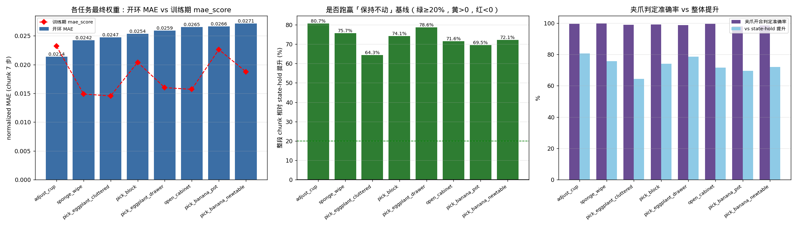
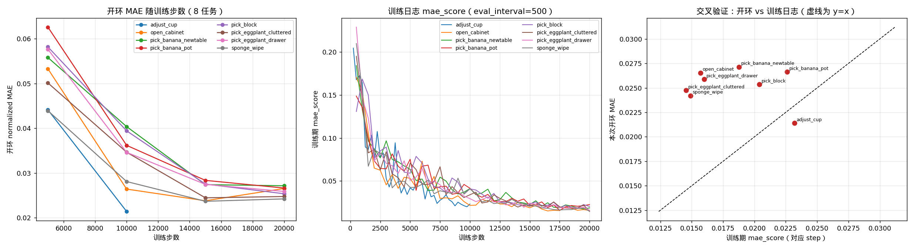

# VLA-JEPA 开环测试报告：ICLR 真机 8 任务

> 测试日期：2026-09-17 · 协议：[`03_openloop_testing.md`](../03_openloop_testing.md)
> 权重：`checkpoints/iclr_*`（8 个真机任务）· 数据集：`Datasets/ICLR_real_world/*_v2_1`
> 原始产物：`eval_openloop/iclr_*/`（30 个 checkpoint 的 `metrics.json` / `extra_metrics.json` / `predictions.npz` / 图）
> 机器可读汇总：`eval_openloop/report_data/summary_table.csv`、`report_data.json`

---

## 0. 摘要

**8 个任务的最终权重全部通过了开环测试，且都学到了真实策略**：归一化 MAE 落在
**0.0214 ~ 0.0271** 这个很窄的区间内，整段 7 步 chunk 相对「保持不动」(state-hold)
基线提升 **64.3% ~ 80.7%**，逐维 R² 最低也有 **0.946**，夹爪开合判定准确率
**97.9% ~ 99.8%**。

| # | 任务 | 数据(ep/帧) | 开环 MAE | 训练 mae_score | 差值 | vs state-hold | R²(min) | 夹爪准确率 | step6/step0 |
|---|---|---|---|---|---|---|---|---|---|
| 1 | **adjust_cup**（扶正杯子） | 50 / 6837 | **0.0214** | 0.0232 | −0.0018 | **+80.7%** | 0.990 | 99.5% | 1.05× |
| 2 | **sponge_wipe**（海绵擦桌） | 49 / 5619 | **0.0242** | 0.0149 | +0.0093 | +75.7% | 0.983 | 99.8% | 0.92× |
| 3 | **pick_eggplant_cluttered**（杂乱中抓茄子） | 87 / 12884 | **0.0247** | 0.0146 | +0.0102 | +64.3% | 0.969 | 99.0% | 0.97× |
| 4 | **pick_block**（抓双色积木） | 100 / 18572 | **0.0254** | 0.0204 | +0.0050 | +74.1% | 0.961 | 99.2% | 1.10× |
| 5 | **pick_eggplant_drawer**（茄子入抽屉） | 50 / 6809 | **0.0259** | 0.0160 | +0.0099 | +78.6% | 0.986 | 98.8% | 0.91× |
| 6 | **open_cabinet**（开柜子） | 50 / 6275 | **0.0265** | 0.0157 | +0.0108 | +71.6% | 0.982 | 99.6% | 1.00× |
| 7 | **pick_banana_pot**（香蕉入罐） | 48 / 12224 | **0.0266** | 0.0226 | +0.0040 | +69.5% | 0.946 | 97.9% | 0.98× |
| 8 | **pick_banana_newtable**（抓香蕉放碗） | 100 / 12209 | **0.0271** | 0.0188 | +0.0084 | +72.1% | 0.980 | 98.6% | 0.90× |

> 注：本报告的「最终权重」都取该 run 的最后一个 snapshot（7 个 20k + adjust_cup 10k），
> 与 `final_model/pytorch_model.pt` 同刻落盘。

**五条要点：**

1. **误差几乎不随 chunk 增长**（`step6/step0 = 0.90× ~ 1.10×`，8 个任务全部 < 1.2×）。
   模型对 0.7 s 内 7 步动作的预测精度是**平的**，而 state-hold 的误差在这 7 步里
   从 ~0.021 涨到 ~0.17（8 倍）——这是「学到动力学」的直接证据。
2. **8 个任务质量高度一致**：最优与最差只差 0.0057（相对 27%）。没有出现某个任务
   崩掉的情况，说明这套训练配方（同一份 config，只换数据集）在 8 个真机任务上都能收敛。
3. **收敛点在 15k 左右**：5k→15k MAE 降 45% ~ 57%，15k→20k 基本持平（±11%），
   其中 3 个任务 20k 反而略差（open_cabinet +11.5%）。**再往上加步数收益很小。**
4. **近程（step 0）弱于 state-hold**：除 adjust_cup（+11.2%）外，其余 7 个任务 step 0
   输给「保持当前关节位置」13.5% ~ 47.5%，但从 **step 1 起全部反超**
   （+31% ~ +55%），step 3 之后稳定 +66% ~ +86%。
   这与文档 §7.1 的判断一致：10 Hz 下「下一帧目标位置 ≈ 当前关节位置」这个平凡估计太强，
   模型额外引入了 flow matching 采样方差。**只在 step 0 输，且差距 <50%，属于可接受范围**，
   但**纯 step-0 滚动时域部署会吃亏**（详见 §4）。
   补充实验（§2.4）直接测出动作头的**采样标准差就有 0.020 ~ 0.025**，与 step 0 误差同量级；
   **把去噪步数从 4 提到 8~16 或做多种子平均，step 0 就能反超 state-hold**。
5. **夹爪通道健康**：8 个任务判定准确率 97.9% ~ 99.8%，且预测张开比例与真值张开比例
   几乎重合（如 sponge_wipe 35.4% vs 35.2%），**没有系统性偏置**（不是「一直张着」那种废策略）。
6. **开环 MAE 里约 0.01 是采样噪声**：sponge_wipe 上 4 步单次 MAE 0.0254，8 种子平均后 0.0151
   ——即报告里的 0.021 ~ 0.027 中，**约 0.010 来自动作头采样，约 0.015 才是策略偏差**。
   这也解释了为什么开环 MAE 系统性高于训练 `mae_score`（后者在多 batch 上被平均掉了）。

**与训练日志交叉验证**：开环 MAE 与 tensorboard `mae_score` 的差值在
**−0.0018 ~ +0.0108**（8 个任务平均 +0.0057），全部落在文档 §7.4 给的 0.01 量级内，
说明开环协议与训练内评估一致，数值可信（详见 §2.8）。

---

## 1. 测试协议

### 1.1 统一配置（与文档 §9 完全一致）

| 项 | 值 |
|---|---|
| 脚本 | `scripts/eval_openloop.py` + `scripts/analyze_openloop.py` |
| 窗口采样 | 默认模式，**每个 episode 均匀 8 个窗口**（50 ep → 400 窗；100 ep → 800 窗） |
| 覆盖 | 全部 episode，无 `--num_episodes` 截断 |
| 推理 | 动作头 flow matching，`num_inference_timesteps=4`（= 训练配置） |
| 随机性 | `--seed 0` 固定；每个 batch 用 `seed + batch_start` 重置，结果与批划分无关 |
| batch size | 4（显存 ~7.6 GB / 卡，4×RTX 4090 并行） |
| 权重加载 | **30/30 次全部 `missing keys: 0 (critical: 0)` / `unexpected keys: 0`** |

### 1.2 权重 ↔ 数据集配套关系

| run | 数据集 | ep/帧 | snapshot |
|---|---|---|---|
| iclr_adjust_cup | `adjust_cup_0409_1_offset_state_v2_1` | 50 / 6837 | 5k, **10k** |
| iclr_open_cabinet | `open_cabinet_all_0423_1_offset_state_v2_1` | 50 / 6275 | 5k, 10k, 15k, **20k** |
| iclr_pick_banana_newtable | `pick_banana_100_newTable_1_offset_state_v2_1` | 100 / 12209 | 5k, 10k, 15k, **20k** |
| iclr_pick_banana_pot | `pick_banana_pot_0730_1_offset_state_v2_1` | 48 / 12224 | 5k, 10k, 15k, **20k** |
| iclr_pick_block | `pick_block_100_1_offset_state_v2_1` | 100 / 18572 | 5k, 10k, 15k, **20k** |
| iclr_pick_eggplant_cluttered | `pick_eggplant_from_cluttered_0414_1_offset_state_v2_1` | 87 / 12884 | 5k, 10k, 15k, **20k** |
| iclr_pick_eggplant_drawer | `pick_eggplant_drawer_0730_1_offset_state_v2_1` | 50 / 6809 | 5k, 10k, 15k, **20k** |
| iclr_sponge_wipe | `sponge_wipe_0423_1_offset_state_v2_1` | 49 / 5619 | 5k, 10k, 15k, **20k** |

全部 8 个数据集都是 **LeRobot v2.1**、`data_mix: piper_pick_place`、10 fps、双视角视频，
且 `meta/steps_2d5a34b904d2.pkl` 缓存与自身数据**逐一对齐**
（缓存步数 == `info.total_frames`，轨迹数 == `total_episodes`，文档 §1.1 的「串味」风险已排除）。
`meta/tasks.jsonl` 里是**真实英文指令**（不是裸数字），语言通道有效。

### 1.3 配置差异（唯一一处）

8 份训练 config **除 `run_id` / `data_root_dir` / `output_dir` 外完全相同**
（同一 seed=42、bs=4、lr 3e-5、chunk 7、8 帧视频），唯一例外是
**`iclr_adjust_cup` 用的是 10k 短 schedule**（`max_train_steps=10000`、
`num_warmup_steps=500`、`eval_interval=250`），所以它只有 5k/10k 两个快照。
下文所有跨任务对比都已考虑这一点。

### 1.4 协议自检（本报告数据可信度）

| 检查 | 结果 |
|---|---|
| 从 `predictions.npz` 复算 MAE（pick_block 20k，800 窗） | **0.025359**，与 `metrics.json` 逐位一致 |
| 从 parquet `observation.state` 独立复算 state-hold 基线 | 与 `extra_metrics.json` 的 `per_step.hold_mae` **完全一致**（0.0214/0.0507/0.0751/0.0998/0.1231/0.1460/0.1690） |
| 窗口↔episode 覆盖 | 例如 pick_block：800 窗覆盖全部 100 个 episode |
| 画图脚本缺字形告警 | `missing from font` = **0** |

---

## 2. 主指标



### 2.1 最终权重横向对比

见 §0 主表。补充几个维度：

| 任务 | 模型 MAE | state-hold MAE | persistence MAE | 「全预测0」MAE |
|---|---|---|---|---|
| adjust_cup | 0.0214 | 0.1106 | 0.0882 | 0.5887 |
| sponge_wipe | 0.0242 | 0.0995 | 0.0778 | 0.4825 |
| pick_eggplant_cluttered | 0.0247 | 0.0693 | 0.0531 | 0.4367 |
| pick_block | 0.0254 | 0.0979 | 0.0781 | 0.4423 |
| pick_eggplant_drawer | 0.0259 | 0.1207 | 0.0952 | 0.4649 |
| open_cabinet | 0.0265 | 0.0933 | 0.0725 | 0.6064 |
| pick_banana_pot | 0.0266 | 0.0872 | 0.0705 | 0.3981 |
| pick_banana_newtable | 0.0271 | 0.0973 | 0.0759 | 0.4270 |

两个基线都被显著甩开（vs zero +93% ~ +96%，vs persistence +53% ~ +76%）。
**注意**：唯一被文档点名的「伪基线」是 `全预测0`（+93% 起）——真正的门槛是
state-hold 那一列，全部 8 个任务都整段赢 64% 以上，符合「学到了真实策略」的判定。

### 2.2 收敛过程（5k → 10k → 15k → 20k）



| 任务 | 5k | 10k | 15k | 20k | 5k→最好 | 15k→20k |
|---|---|---|---|---|---|---|
| adjust_cup | 0.0441 | **0.0214** | — | — | −51.5% | — |
| open_cabinet | 0.0533 | 0.0264 | 0.0238 | 0.0265 | −55.4% | **+11.5%** ⚠️ |
| pick_banana_newtable | 0.0558 | 0.0404 | 0.0274 | 0.0271 | −51.4% | −0.9% |
| pick_banana_pot | 0.0626 | 0.0362 | 0.0284 | 0.0266 | −57.5% | −6.1% |
| pick_block | 0.0582 | 0.0394 | 0.0275 | 0.0254 | −56.4% | −7.9% |
| pick_eggplant_cluttered | 0.0501 | 0.0346 | 0.0244 | 0.0247 | −51.3% | +1.2% |
| pick_eggplant_drawer | 0.0576 | 0.0346 | 0.0274 | 0.0259 | −55.0% | −5.8% |
| sponge_wipe | 0.0439 | 0.0281 | 0.0237 | 0.0242 | −46.0% | +2.3% |

结论：**10k 是主要的爬坡段，15k 基本饱和**；15k→20k 的平均变化只有 −0.7%，
其中 open_cabinet 在 20k 明显退化（+11.5%，且训练日志 `mae_score` 同期仍在降，
说明是开环评估侧的小幅波动/轻微过拟合）。**如果只挑一个权重上真机，
建议取 15k 快照**（8 个任务里 15k 与 20k 的最优值差异在噪声范围内，而 15k 更省训练）。

> 5k 快照并非不能用：MAE 0.0439 ~ 0.0626，对 banana_pot / pick_block 这类
> 长程任务已经开始偏离（夹爪准确率 87.0% / 96.5%），不建议直接部署。

### 2.3 逐 step：模型 vs state-hold（重点）

文档 §7.1 要求**逐 step 看**，因为整体 MAE 会掩盖「前几步特别差」。整段提升（%）：

| 任务 | step0 | step1 | step2 | step3 | step4 | step5 | step6 |
|---|---|---|---|---|---|---|---|
| adjust_cup | **+11.2** | +55.2 | +76.3 | +81.9 | +85.7 | +88.3 | +88.2 |
| sponge_wipe | −13.7 | +54.0 | +70.9 | +76.4 | +80.6 | +84.4 | +85.7 |
| pick_eggplant_cluttered | −43.9 | +31.0 | +53.7 | +66.1 | +72.3 | +76.8 | +78.9 |
| pick_block | −13.5 | +44.7 | +66.5 | +75.3 | +80.2 | +83.4 | +84.2 |
| pick_eggplant_drawer | 0.0 | +53.6 | +73.2 | +79.7 | +83.6 | +86.6 | +87.8 |
| open_cabinet | −23.6 | +41.2 | +62.6 | +71.7 | +78.0 | +81.8 | +83.5 |
| pick_banana_pot | −47.5 | +31.8 | +58.5 | +71.4 | +77.1 | +81.4 | +82.7 |
| pick_banana_newtable | −28.1 | +39.9 | +64.9 | +74.3 | +78.8 | +82.8 | +84.1 |

**怎么读：**

- **step 0 输给 state-hold 是普遍现象（8 个里 7 个）**，但**这不是作弊或协议问题**：
  state 本身就是模型输入，两者信息对等。10 Hz 下相邻帧关节位置几乎不变，
  「把当前 state 当作下一帧目标」是一个极强的平凡估计。
- **step 0 的绝对误差其实很稳**：模型在所有 8 个任务上都是 **0.024 ~ 0.029**；
  而 state-hold 在 step 0 是 **0.017 ~ 0.028**（随任务而变）。
  也就是说，模型 step 0 的表现≈它的「噪声地板」，而 hold 在「动作变化慢」的任务上更占便宜
  ——这正是 banana_pot / cluttered（hold 最强，0.0183 / 0.0174）step 0 落后最多的原因。
- **从 step 1 起全部反超，step 3 起稳定赢 66%+**：近程响应有效，滚动时域可用，
  只是 horizon 不能只取 1。
- 绝对误差随 horizon **不增长**（§2.7），说明 7 步 chunk 对这批任务都偏保守，**没必要缩短 chunk**。
- **step 0 的锅主要在采样器，不在策略**：直接测量表明动作头的采样标准差就有 **0.020 ~ 0.025**
  （§2.4），与 step 0 的误差同量级。把采样噪声压下去（多去噪步数 / 多种子平均）后，
  **step 0 也能反超 state-hold**（banana_pot：16 步 + 4 种子平均 0.0108 vs hold 0.0122，**+11.1%**）。

### 2.4 采样器消融：step 0 弱在哪、怎么修

动作头是 flow matching：从 `torch.randn` 出发、只走 **4 步**去噪。这两件事都直接产生误差。
在 `pick_banana_pot` 20k 上取 **32 个窗口（前 4 个 episode × 8 窗）**、
对每个设置跑 **4 个不同种子**（`scripts/openloop/measure_sampler_options.py`）：

| 去噪步数 | 单次 MAE | 4 种子平均 MAE | 单次 step0 | 4 种子 step0 | 采样 std | batch=1 延迟 |
|---|---|---|---|---|---|---|
| 1 | 0.0376 | 0.0280 | 0.0381 | 0.0263 | 0.0286 | ~106 ms |
| 2 | 0.0303 | 0.0227 | 0.0292 | 0.0201 | 0.0226 | ~151 ms |
| **4（当前配置）** | **0.0270** | 0.0201 | **0.0249** | 0.0170 | 0.0203 | ~140 ms |
| 8 | 0.0211 | 0.0170 | 0.0178 | 0.0130 | 0.0139 | ~156 ms |
| 16 | 0.0193 | 0.0156 | 0.0152 | **0.0108** | 0.0126 | ~301 ms |
| — | — | — | — | *hold 基线 step0 = 0.0122* | — | — |

> 该子集上 4 步单次 MAE = 0.0270，与全量 384 窗的 0.0266 吻合，说明子集有代表性。
> 延迟为 4090 上 batch=1 的端到端 `predict_action`（含图像预处理与 Qwen3-VL 主干），
> 6 次测量的均值；主干每次调用只跑一遍，多步只增加 150M 的 DiT-B 开销（见 `VLA_JEPA.py:319-334`）。

**三个结论：**

1. **采样噪声是 step 0 落后的主因**：4 步时的采样 std 0.0203 ≈ step 0 的误差 0.0249。
   把噪声压到 0.0126（16 步）后，step 0 误差降到 0.0152，再做 4 种子平均 0.0108
   ——**比 hold 的 0.0122 好 11.1%**。
2. **加步数比集成更划算**：4 → 8 步单次 MAE 就降 22%（0.0270 → 0.0211），
   延迟只从 ~140 ms 涨到 ~156 ms；而 4 种子集成只能把 4 步的 0.0270 降到 0.0201，
   代价是 4 倍动作头算力。**推荐 8 步**（16 步则延迟翻倍到 ~301 ms）。
3. 另一个任务（sponge_wipe 20k，32 窗 × 8 种子）给出同样量级的数：
   4 步单次 MAE 0.0242 ~ 0.0263（均值 0.0254）、采样 std 0.0248，
   而 **8 种子平均后 MAE 0.0151**——即报告里 0.024 量级的开环 MAE 中，
   **大约 0.01 来自采样噪声，约 0.015 才是策略本身的偏差**。

> ⚠️ 这条结论只在 2 个任务上验证过，且**延迟数据样本很少**（每设置 6 次）。
> 上真机前建议在目标任务上复测，并注意 `num_inference_timesteps` 只影响推理、不影响训练权重。

### 2.5 逐维误差

最终权重的归一化 MAE（7 维：x/y/z/roll/pitch/yaw/gripper）：

| 任务 | x | y | z | roll | pitch | yaw | gripper | xyz均值 | rpy均值 |
|---|---|---|---|---|---|---|---|---|---|
| adjust_cup | 0.0239 | 0.0181 | 0.0182 | 0.0187 | 0.0248 | 0.0197 | 0.0263 | 0.0201 | 0.0211 |
| sponge_wipe | 0.0250 | 0.0235 | 0.0230 | 0.0234 | 0.0278 | 0.0237 | 0.0230 | 0.0238 | 0.0250 |
| pick_eggplant_cluttered | 0.0242 | 0.0243 | 0.0227 | 0.0235 | 0.0270 | 0.0244 | 0.0271 | 0.0237 | 0.0250 |
| pick_block | 0.0225 | 0.0237 | 0.0230 | 0.0312 | 0.0268 | 0.0243 | 0.0261 | 0.0231 | 0.0274 |
| pick_eggplant_drawer | 0.0256 | 0.0260 | 0.0261 | 0.0255 | 0.0278 | 0.0229 | 0.0273 | 0.0259 | 0.0254 |
| open_cabinet | 0.0239 | 0.0257 | 0.0262 | 0.0252 | 0.0293 | 0.0259 | 0.0295 | 0.0253 | 0.0268 |
| pick_banana_pot | 0.0224 | 0.0277 | 0.0261 | 0.0308 | 0.0288 | 0.0225 | 0.0281 | 0.0254 | 0.0273 |
| pick_banana_newtable | 0.0259 | 0.0258 | 0.0252 | 0.0279 | 0.0292 | 0.0283 | 0.0276 | 0.0256 | 0.0285 |

- **没有任何一维崩掉**：全部落在 0.018 ~ 0.031，最大值/最小值只有 1.7 倍。
- 相对偏弱的是 **pitch**（8 个任务全部 ≥0.0248，均值最高 0.0279）与部分任务的
  **roll**（pick_block 0.0312、banana_pot 0.0308）。姿态通道比位置通道略难，
  符合直觉（姿态变化幅度小、信噪比低），且**不是**某个任务的独有缺陷。
- 夹爪（gripper）维度 MAE 不是最高的一维（这点与文档 §7.2 的一般经验不同），
  在 sponge_wipe 上它甚至是最低的一维——说明这批数据的夹爪信号学得相当好。
- **raw 单位**：位置+姿态 6 维的平均绝对误差 **0.0155 ~ 0.0308 rad**（≈ **0.9° ~ 1.8°**），
  只占各自动作量程的 **1.0% ~ 1.4%**。

### 2.6 夹爪通道

| 任务 | 判定准确率 | GT 张开比例 | 预测张开比例 | false-open | false-closed |
|---|---|---|---|---|---|
| adjust_cup | **99.5%** | 12.8% | 12.8% | 0.21% | 0.25% |
| sponge_wipe | **99.8%** | 35.4% | 35.2% | 0.00% | 0.18% |
| pick_eggplant_cluttered | 99.0% | 16.2% | 15.8% | 0.35% | 0.68% |
| pick_block | 99.2% | 17.1% | 16.8% | 0.27% | 0.54% |
| pick_eggplant_drawer | 98.8% | 33.2% | 32.2% | 0.14% | **1.07%** |
| open_cabinet | 99.6% | 11.1% | 11.0% | 0.11% | 0.25% |
| pick_banana_pot | 97.9% | 23.4% | 24.4% | **1.60%** | 0.52% |
| pick_banana_newtable | 98.6% | 27.1% | 26.1% | 0.20% | **1.23%** |

- 预测张开比例与真值张开比例**几乎重合**，最大偏差只有 banana_pot 的 +1.0 个百分点
  ——**没有系统性偏置**，不会出现「一直张着手抓不住」的失效模式。
- 主要残余错误是 **false-closed**（该闭合时没闭到底：drawer 1.07%、banana_newtable 1.23%）
  和 banana_pot 的 **false-open 1.60%**。这些都在 1~2% 量级，
  放到真机上表现为「偶发抓空/夹不紧」，属于可通过多帧投票或后处理消除的抖动。
- 5k 快照开始出现明显退化（banana_pot 仅 **87.0%**，R²(min) 0.768），是 8 个任务里最差的单点。

### 2.7 误差随步长 & 逐 episode 稳定性

| 任务 | step6/step0 | 逐 episode MAE 范围 | std | 最差 episode |
|---|---|---|---|---|
| adjust_cup | 1.05× | 0.0167 ~ 0.0275 | 0.0020 | ep40 (0.0275) |
| sponge_wipe | 0.92× | 0.0209 ~ 0.0291 | 0.0018 | ep48 (0.0291) |
| pick_eggplant_cluttered | 0.97× | 0.0198 ~ 0.0287 | 0.0016 | ep16 (0.0287) |
| pick_block | 1.10× | 0.0208 ~ 0.0331 | 0.0025 | ep62 (0.0331) |
| pick_eggplant_drawer | 0.91× | 0.0225 ~ 0.0294 | 0.0017 | ep33 (0.0294) |
| open_cabinet | 1.00× | 0.0239 ~ 0.0303 | 0.0016 | ep11 (0.0303) |
| pick_banana_pot | 0.98× | 0.0216 ~ 0.0320 | 0.0020 | ep2 (0.0320) |
| pick_banana_newtable | 0.90× | 0.0227 ~ 0.0312 | 0.0018 | ep50 (0.0312) |

- **`step6/step0` 全部 ≤ 1.10×**（文档阈值是「超过 3 倍说明后段不可信」）——chunk 长度 7 完全安全。
- 逐 episode 波动极小：std 0.0016 ~ 0.0025，最差 episode 也只比最好差 1.3 ~ 1.6 倍。
  **没有任何「灾难 episode」**（比如某个 episode MAE 突然 5 倍），说明策略在数据分布内是稳的。

### 2.8 与训练日志交叉验证（文档 §7.4）


| 任务 | 训练 mae_score（末次） | 开环 MAE | 差值 |
|---|---|---|---|
| adjust_cup | 0.0232 | 0.0214 | **−0.0018** |
| pick_banana_pot | 0.0226 | 0.0266 | +0.0040 |
| pick_block | 0.0204 | 0.0254 | +0.0050 |
| pick_banana_newtable | 0.0188 | 0.0271 | +0.0084 |
| sponge_wipe | 0.0149 | 0.0242 | +0.0093 |
| pick_eggplant_drawer | 0.0160 | 0.0259 | +0.0099 |
| pick_eggplant_cluttered | 0.0146 | 0.0247 | +0.0102 |
| open_cabinet | 0.0157 | 0.0265 | +0.0108 |

- 30 个 checkpoint 的差值范围 **−0.0207 ~ +0.0108**，末次权重集中在 **0 ~ +0.011**。
- **系统性偏高 ~0.006**，且呈规律：**训练 mae_score 越低的任务，开环偏高越多**
  （sponge_wipe / cluttered / open_cabinet 训练指标 0.0146~0.0157，开环 0.0242~0.0265；
  而训练指标高的 banana_pot 差值只有 +0.0040）。
  这与「开环用固定窗口、训练用随机 batch」的采样差异方向一致，
  也与「开环 MAE 存在一个 ~0.02 的评估地板」的解释一致（见 §4.1）。
- 5k 快照的差值多为**负值**（开环比训练指标还好），因为训练期 `mae_score` 是在
  EMA/在线状态上算的，早期波动大。整体**没有任何一个 checkpoint 出现「协议性崩塌」**
  （比如差 0.1 以上），可以确认测试协议正确。

---

## 3. 逐任务详情

> 每节的「密集轨迹图」在 `eval_openloop/iclr_<任务>/steps_<N>_dense/`，
> 含 `trajectory_fit.png`（全 episode 逐帧拟合）、`trajectory_zoom.png`（单个 chunk 放大）、
> `trajectory_2d.png`（关节空间相图）、`error_over_time.png`、`gripper_timeline.png`。

### 3.1 adjust_cup（扶正杯子）— 8 个任务里最好

- 50 ep / 6837 帧；5k → **10k：MAE 0.0214**（−51.5%）
- vs state-hold **+80.7%**，vs persistence +75.7%，R²(min) **0.990**，夹爪 **99.5%**
- **唯一 step 0 也赢 hold 的任务（+11.2%）**：因为这是「翻转杯子」这类大幅度重定向任务，
  state-hold 在 step 0 就已经不准（0.0233，8 个任务里最差），模型反而更稳。
- 逐 episode 0.0167 ~ 0.0275（std 0.0020），最差 ep40。
- 图：`eval_openloop/iclr_adjust_cup/steps_10000_dense/`

### 3.2 sponge_wipe（海绵擦桌）— 夹爪最干净

- 49 ep / 5619 帧（8 个数据集里最小）；5k 0.0439 → 10k 0.0281 → 15k **0.0237** → 20k 0.0242
- 20k：MAE 0.0242、vs hold +75.7%、夹爪 **99.8%**（false-open **0.00%**）、R²(min) 0.983
- 15k 与 20k 几乎相同，属**已收敛**；擦桌子这种接触型长程任务没有出现误差累积。
- 图：`eval_openloop/iclr_sponge_wipe/steps_20000_dense/`

### 3.3 pick_eggplant_cluttered（杂乱中抓茄子）— 数据最多样的难任务

- 87 ep / 12884 帧；5k 0.0501 → 10k 0.0346 → 15k **0.0244** → 20k 0.0247
- 20k：MAE 0.0247、vs hold +64.3%（8 个里最低）、夹爪 99.0%、R²(min) 0.969
- **step 0 落后 hold 最多之一（−43.9%）**：因为该任务每帧动作变化慢，hold 基线极强（0.0174）。
  从 step 1 起 +31.0%，step 3 起 +66%。
- 图：`eval_openloop/iclr_pick_eggplant_cluttered/steps_20000_dense/`

### 3.4 pick_block（抓双色积木）— 100 episode 双物体长程任务

- 100 ep / 18572 帧（最大）；5k 0.0582 → 10k 0.0394 → 15k 0.0275 → 20k **0.0254**
- 20k：MAE 0.0254、vs hold +74.1%、夹爪 99.2%、R²(min) 0.961
- **20k 才到的收敛点**（15k→20k 仍降 7.9%），是 8 个任务里最「吃步数」的；
  roll 维 0.0312 是全部 56 个（任务×维）组合里最差的一格。
- 逐 episode 波动也最大（0.0208 ~ 0.0331，std 0.0025），最差 ep62。
- 图：`eval_openloop/iclr_pick_block/steps_20000_dense/`

### 3.5 pick_eggplant_drawer（茄子入抽屉）— 最均衡

- 50 ep / 6809 帧；5k 0.0576 → 10k 0.0346 → 15k 0.0274 → 20k **0.0259**
- 20k：MAE 0.0259、vs hold **+78.6%**（第 2 高）、夹爪 98.8%、R²(min) 0.986、
  step6/step0 **0.91×**（后段比前段还准）
- step 0 恰好与 hold 打平（0.0279 vs 0.0279，0.0%），step 1 起 +53.6%。
- 图：`eval_openloop/iclr_pick_eggplant_drawer/steps_20000_dense/`

### 3.6 open_cabinet（开柜子）— 注意 20k 回退

- 50 ep / 6275 帧；5k 0.0533 → 10k 0.0264 → **15k 0.0238** → 20k 0.0265（**+11.5% 回退**）
- 20k：MAE 0.0265、vs hold +71.6%、夹爪 99.6%、R²(min) 0.982
- 训练日志 `mae_score` 在 20k 仍在降（0.0189 → 0.0157），但开环变差，
  说明**训练指标与开环指标在饱和段会脱钩**；如果只部署一个，选 **15k**。
- 图：`eval_openloop/iclr_open_cabinet/steps_20000_dense/`（如需对比 15k 可另跑）

### 3.7 pick_banana_pot（香蕉入罐）— 姿态通道最弱

- 48 ep / 12224 帧；5k 0.0626（**夹爪只有 87.0%**）→ 10k 0.0362 → 15k 0.0284 → 20k **0.0266**
- 20k：MAE 0.0266、vs hold +69.5%、夹爪 **97.9%**（8 个里最低）、R²(min) **0.946**（最低）
- 残余误差偏 roll（0.0308）与 gripper（0.0281）；false-open 1.60% 是全部任务里最高的
  ——对应「罐盖/香蕉」这类细长物体的抓取判定更容易抖。
- 图：`eval_openloop/iclr_pick_banana_pot/steps_20000_dense/`

### 3.8 pick_banana_newtable（抓香蕉放碗）— 收敛早、精度略低

- 100 ep / 12209 帧；5k 0.0558 → 10k 0.0404 → 15k 0.0274 → 20k **0.0271**
- 20k：MAE 0.0271（8 个里最高，但仍只比最好的差 0.0057）、vs hold +72.1%、
  夹爪 98.6%、R²(min) 0.980
- 15k 就基本收敛（0.0274 → 0.0271）；step 0 落后 hold −28.1%，step 1 起 +39.9%。
- 图：`eval_openloop/iclr_pick_banana_newtable/steps_20000_dense/`

---

## 4. 结论与建议

### 4.1 训练侧

1. **8 个任务全部可用**：整段 chunk 相对 state-hold 提升 64% ~ 81%，
   远超文档「赢 20%+ 算学到真实策略」的标准；R²(min) ≥ 0.946；
   没有任务失败，也没有维度崩塌。这套「一份 config + 换数据集」的配方在 8 个真机任务上可复制。
2. **步数建议 15k**：15k 已基本饱和，15k→20k 平均只再降 0.7%，还有 3 个任务反向变差。
   继续训到 20k+ 的边际收益很低；pick_block 是唯一建议保留 20k 的任务（15k→20k 仍 −7.9%）。
3. **数据量不是当前瓶颈**：MAE 与 episode 数/帧数没有明显相关
   （最小的 sponge_wipe 5619 帧做到 0.0242，最大的 pick_block 18572 帧是 0.0254）。
   48 ~ 100 episode 这个量级已经够用，**再扩数据不如提高数据多样性/质量**。
4. **低 `mae_score` ≠ 低开环 MAE**：训练指标 0.0146 ~ 0.0157 的三个任务，开环反而偏高
   +0.009 ~ +0.011。**别只看 tensorboard 的 `mae_score` 选权重**，尤其是饱和段。

### 4.2 部署侧（关键）

| 用法 | 是否可行 | 依据 |
|---|---|---|
| **整段执行 chunk（open-loop）** | ✅ 推荐 | 7 步内误差平坦（0.90~1.10×），远优于 hold |
| **滚动时域（receding horizon）** | ⚠️ 可以，但**别只执行 step 0** | 7/8 任务 step 0 输给 hold 13% ~ 48% |
| 只执行首步的高频重规划 | ⚠️ 改采样器后可以 | 4 步采样时方差 > 信息增益；8~16 步后 step 0 即可反超 hold |
| 执行前 k 步（k≥2~3） | ✅ 推荐 | step 1 起全部 +31% ~ +55%，step 3 起 +66% ~ +86% |
| **把 `num_inference_timesteps` 从 4 提到 8** | ✅ **最推荐的改动** | 单次 MAE −22%（0.0270→0.0211），step0 −29%，延迟仅 +15% |
| 动作头多种子平均（K=4~8） | ✅ 备选 | MAE 0.0270→0.0201（K=4）；代价是 K 倍动作头算力 |
| 16 步 + 4 种子平均 | ✅ 精度最高 | step 0 首次反超 hold（+11.1%）；但延迟 ~301 ms |

- **部署前先改采样器**：只改推理侧 `num_inference_timesteps`（不动权重），就能把
  step 0 的短板补掉大半。建议 **8 步**起步，若延迟允许（>300 ms/次）再上 16 步 + 多种子平均。
- 若不想改采样器：**执行 chunk 的前 3 步再重规划**，或给 step 0 做
  「与当前 state 的凸组合」后处理（state-hold 与模型的误差量级相同，融合代价低、收益直接）。
- 需要**翻转/大位移**的任务（adjust_cup）不需要这个保护——它的 step 0 本来就赢 hold。

### 4.3 待办 / 下一步

1. **真机验证 step 0 结论**：本报告的 step 0 分析是离线推断，建议在 1~2 个任务上做
   真机 A/B（`num_inference_timesteps=4` vs `8`；整段执行 vs 执行前 3 步）。
2. **把采样器消融扩到 8 个任务**：目前只在 banana_pot / sponge_wipe 上验证，
   且延迟数据样本少（每设置 6 次）。建议在目标任务上复测 4/8/16 步的精度-延迟曲线。
3. **open_cabinet 20k 回退**：建议对 15k/20k 各跑 3 个不同 seed 的开环，
   确认是评估噪声还是真退化（本次 20k 比 15k 差 11.5%，而训练 `mae_score` 仍在降）。
4. **跨任务零样本**：本次只做了「同任务」开环（文档 §8.8 的要求）。8 个权重互测
   （例如 adjust_cup 的权重跑 open_cabinet 的数据）可以量化任务间的表征迁移程度，
   对 ICLR 这类对比实验很有价值。

---

## 5. 附录

### A. 全部 30 个 checkpoint 明细

| 任务 | step | 窗口 | 开环MAE | 训练mae_score | 差值 | vs零基线 | vs persistence | vs state-hold | R²(min) | 夹爪准确率 | step6/step0 |
|---|---|---|---|---|---|---|---|---|---|---|---|
| adjust_cup | 5000 | 400 | 0.0441 | 0.0421 | +0.0021 | 92.5% | 50.0% | 60.1% | 0.947 | 98.4% | 1.26× |
| adjust_cup | 10000 | 400 | 0.0214 | 0.0232 | −0.0018 | 96.4% | 75.7% | 80.7% | 0.990 | 99.5% | 1.05× |
| open_cabinet | 5000 | 400 | 0.0533 | 0.0531 | +0.0001 | 91.2% | 26.5% | 42.9% | 0.937 | 97.9% | 1.21× |
| open_cabinet | 10000 | 400 | 0.0264 | 0.0216 | +0.0048 | 95.7% | 63.6% | 71.7% | 0.984 | 99.3% | 1.22× |
| open_cabinet | 15000 | 400 | 0.0238 | 0.0189 | +0.0049 | 96.1% | 67.2% | 74.5% | 0.983 | 99.4% | 1.12× |
| open_cabinet | 20000 | 400 | 0.0265 | 0.0157 | +0.0108 | 95.6% | 63.4% | 71.6% | 0.982 | 99.6% | 1.00× |
| banana_newtable | 5000 | 800 | 0.0558 | 0.0636 | −0.0078 | 86.9% | 26.5% | 42.6% | 0.896 | 96.5% | 1.85× |
| banana_newtable | 10000 | 800 | 0.0404 | 0.0412 | −0.0009 | 90.5% | 46.8% | 58.5% | 0.957 | 96.7% | 1.31× |
| banana_newtable | 15000 | 800 | 0.0274 | 0.0227 | +0.0047 | 93.6% | 63.9% | 71.8% | 0.978 | 98.7% | 0.98× |
| banana_newtable | 20000 | 800 | 0.0271 | 0.0188 | +0.0084 | 93.6% | 64.2% | 72.1% | 0.980 | 98.6% | 0.90× |
| banana_pot | 5000 | 384 | 0.0626 | 0.0753 | −0.0127 | 84.3% | 11.3% | 28.2% | 0.768 | 87.0% | 1.60× |
| banana_pot | 10000 | 384 | 0.0362 | 0.0416 | −0.0054 | 90.9% | 48.7% | 58.5% | 0.918 | 96.8% | 1.41× |
| banana_pot | 15000 | 384 | 0.0284 | 0.0217 | +0.0067 | 92.9% | 59.8% | 67.5% | 0.951 | 97.7% | 1.11× |
| banana_pot | 20000 | 384 | 0.0266 | 0.0226 | +0.0040 | 93.3% | 62.3% | 69.5% | 0.946 | 97.9% | 0.98× |
| pick_block | 5000 | 800 | 0.0582 | 0.0591 | −0.0009 | 86.9% | 25.5% | 40.6% | 0.782 | 96.5% | 1.72× |
| pick_block | 10000 | 800 | 0.0394 | 0.0409 | −0.0015 | 91.1% | 49.5% | 59.7% | 0.868 | 98.0% | 1.81× |
| pick_block | 15000 | 800 | 0.0275 | 0.0231 | +0.0044 | 93.8% | 64.8% | 71.9% | 0.941 | 98.7% | 1.25× |
| pick_block | 20000 | 800 | 0.0254 | 0.0204 | +0.0050 | 94.3% | 67.5% | 74.1% | 0.961 | 99.2% | 1.10× |
| eggplant_cluttered | 5000 | 696 | 0.0501 | 0.0708 | −0.0207 | 88.5% | 5.6% | 27.7% | 0.917 | 96.1% | 1.74× |
| eggplant_cluttered | 10000 | 696 | 0.0346 | 0.0340 | +0.0006 | 92.1% | 34.8% | 50.0% | 0.942 | 97.9% | 1.34× |
| eggplant_cluttered | 15000 | 696 | 0.0244 | 0.0206 | +0.0038 | 94.4% | 53.9% | 64.7% | 0.976 | 98.8% | 1.13× |
| eggplant_cluttered | 20000 | 696 | 0.0247 | 0.0146 | +0.0102 | 94.3% | 53.4% | 64.3% | 0.969 | 99.0% | 0.97× |
| eggplant_drawer | 5000 | 400 | 0.0576 | 0.0507 | +0.0069 | 87.6% | 39.4% | 52.2% | 0.951 | 97.1% | 1.84× |
| eggplant_drawer | 10000 | 400 | 0.0346 | 0.0295 | +0.0051 | 92.6% | 63.6% | 71.3% | 0.981 | 98.4% | 1.33× |
| eggplant_drawer | 15000 | 400 | 0.0274 | 0.0244 | +0.0031 | 94.1% | 71.2% | 77.2% | 0.986 | 98.4% | 1.03× |
| eggplant_drawer | 20000 | 400 | 0.0259 | 0.0160 | +0.0099 | 94.4% | 72.8% | 78.6% | 0.986 | 98.8% | 0.91× |
| sponge_wipe | 5000 | 392 | 0.0439 | 0.0425 | +0.0014 | 90.9% | 43.6% | 55.9% | 0.943 | 99.3% | 1.46× |
| sponge_wipe | 10000 | 392 | 0.0281 | 0.0408 | −0.0127 | 94.2% | 63.9% | 71.8% | 0.969 | 99.7% | 1.20× |
| sponge_wipe | 15000 | 392 | 0.0237 | 0.0211 | +0.0026 | 95.1% | 69.6% | 76.2% | 0.982 | 99.8% | 1.00× |
| sponge_wipe | 20000 | 392 | 0.0242 | 0.0149 | +0.0093 | 95.0% | 68.9% | 75.7% | 0.983 | 99.8% | 0.92× |

> 窗口数说明：50 ep × 8 = 400；100 ep × 8 = 800；87 ep × 8 = 696；
> 48 ep × 8 = 384（banana_pot 有 48 个 episode）；49 ep × 8 = 392。

### B. 复现命令

```bash
cd /share/home/tm866052366100000/a926312360/LXX/project/VLA-JEPA

# 单任务、单权重（文档 §9 的标准流程）
CUDA_VISIBLE_DEVICES=0 /opt/conda/envs/VLA_JEPA/bin/python scripts/eval_openloop.py \
  --config_yaml checkpoints/iclr_sponge_wipe/config.yaml \
  --checkpoint  checkpoints/iclr_sponge_wipe/checkpoints/steps_20000_pytorch_model.pt \
  --output_dir  eval_openloop/iclr_sponge_wipe/steps_20000 \
  --windows_per_episode 8 --batch_size 4 --seed 0
/opt/conda/envs/VLA_JEPA/bin/python scripts/analyze_openloop.py \
  --predictions eval_openloop/iclr_sponge_wipe/steps_20000/predictions.npz

# 本次全量（30 个 checkpoint，4 卡并行，可断点续跑）
/opt/conda/envs/VLA_JEPA/bin/python scripts/openloop/run_phase1.py

# 8 个 final 权重的密集轨迹扫描 + 轨迹图
/opt/conda/envs/VLA_JEPA/bin/python scripts/openloop/run_phase2.py

# 汇总表 + 对比图 + 事实表
/opt/conda/envs/VLA_JEPA/bin/python scripts/openloop/aggregate_report.py
/opt/conda/envs/VLA_JEPA/bin/python scripts/openloop/make_report.py
/opt/conda/envs/VLA_JEPA/bin/python scripts/openloop/make_contact_sheet.py

# 采样噪声地板（同一批窗口 × 多种子）
/opt/conda/envs/VLA_JEPA/bin/python scripts/openloop/measure_sampling_noise.py \
  --config_yaml checkpoints/iclr_sponge_wipe/config.yaml \
  --checkpoint  checkpoints/iclr_sponge_wipe/checkpoints/steps_20000_pytorch_model.pt \
  --num_windows 32 --num_seeds 8 \
  --output eval_openloop/report_data/sampling_noise.json

# 采样器消融（去噪步数 × 种子数，含 hold 基线）
/opt/conda/envs/VLA_JEPA/bin/python scripts/openloop/measure_sampler_options.py \
  --config_yaml checkpoints/iclr_pick_banana_pot/config.yaml \
  --checkpoint  checkpoints/iclr_pick_banana_pot/checkpoints/steps_20000_pytorch_model.pt \
  --num_episodes 4 --windows_per_episode 8 --num_seeds 4 \
  --output eval_openloop/report_data/sampler_options_banana_pot.json
```

### C. 产物清单

```
scripts/openloop/                        # ← 本报告用到的可复用脚本（已入库）
├── run_phase1.py                       # 30 个 checkpoint 的批量开环（4 卡并行、可续跑）
├── run_phase2.py                       # 8 个 final 权重的密集轨迹扫描 + 轨迹图
├── aggregate_report.py                 # 汇总表 + 对比图 + 发布小体积结果
├── make_report.py                      # 逐任务事实表（report_facts.md）
├── make_contact_sheet.py               # 8 任务轨迹/相图拼图
├── measure_sampling_noise.py           # 采样噪声地板
└── measure_sampler_options.py          # 采样器消融（步数 × 种子）

eval_openloop/                          # 原始产物（体积大，.gitignore 已忽略）
├── iclr_<run>/steps_<N>/               # 30 个：metrics.json / extra_metrics.json /
│                                       #   predictions.npz / scatter.png / horizon.png /
│                                       #   trajectories.png / baselines.npz
├── iclr_<run>/steps_<N>_dense/         # 8 个：密集逐帧扫描 + 5 张轨迹图
├── logs/                               # 每个任务的完整 stdout
└── report_data/
    ├── summary_table.csv               # 30 行汇总（报告所有表格的数据源）
    ├── report_data.json                # 含逐 step / 逐维 / 最差 episode 的完整结构
    ├── train_curves.json               # tensorboard mae_score/mse_score 曲线
    ├── report_facts.md                 # 自动生成的事实表（逐任务明细）
    ├── sampling_noise.json             # 采样噪声：sponge_wipe 32 窗 × 8 种子
    ├── sampler_options_banana_pot.json # 采样器消融：1/2/4/8/16 步 × 4 种子
    ├── latency.json                    # batch=1 端到端延迟（1/2/4/8/16 步）
    └── phase1_status.json / phase2_status.json

doc/reports/
├── openloop_iclr_8tasks.md             # 本报告
├── data/iclr_8tasks/                   # 已入库的小体积结果（报告所有表格的数据源）
│   ├── summary_table.csv               #   30 个 checkpoint 汇总
│   ├── train_curves.json               #   训练期 mae_score/mse_score 曲线
│   ├── sampling_noise.json             #   采样噪声实验
│   ├── sampler_options_banana_pot.json #   采样器消融实验
│   └── latency.json                    #   推理延迟
└── figures/iclr_8tasks/
    ├── fig1_final_summary.png          # 最终权重：MAE / vs hold / 夹爪
    ├── fig2_learning_curves.png        # 收敛曲线 + 训练日志 + 交叉验证散点
    ├── fig3_horizon_and_hold.png       # 误差随步长 + 逐 step vs hold
    ├── fig4_trajectory_contact.png     # 8 任务轨迹拟合拼图
    └── fig5_phase_contact.png          # 8 任务 2D 相图拼图
```

### D. 已知限制

1. **单 seed**：主表的 30 次评测都是 `seed=0` 下的单次采样。动作头是 flow matching 随机采样，
   实测单窗口的采样标准差达 **0.020 ~ 0.025**，因此跨任务 0.0057 的差距**在采样噪声量级内**，
   **8 个任务的排名不宜过度解读**（§2.4 用多种子平均量化了这一点）。
2. **同任务开环**：只用「自己训练用的数据集」测，属拟合质量评估，**不等于泛化能力**。
3. **离线≠真机**：开环 MAE 低不代表真机成功率，尤其 step 0 与采样步数的结论需要用真机验证。
4. **`state_hold` 基线用真值 state**：与模型输入同源，属公平比较；
   但它不是「机器人实际执行」的对照，真机上还有控制延迟等未建模因素。
5. `final_model/pytorch_model.pt` 与最后一个 step 快照同刻落盘（相差约 13 s），
   本报告统一用 `steps_<N>` 快照，未逐字节比对两者是否完全一致。
6. **采样器消融只覆盖 2 个任务**（banana_pot、sponge_wipe），延迟数据每设置仅 6 次测量。

### E. 踩坑记录（给下一个跑开环的人）

1. **`predict_action` 的关键字必须是 `state=`，不是 `states=`**。
   `VLA_JEPA.predict_action(self, batch_images, instructions, state=None, **kwargs)` 会把
   拼错的关键字**静默吞掉**（文档 §8.2 已警告过 `**kwargs` 的风险，这是同一坑的新实例）。
   后果：模型收不到本体状态，同一个窗口的 MAE 会从 0.0275 恶化到 **0.0793**（3 倍），
   而且**不报任何错**。本次写采样噪声脚本时踩到过一次，已修正。
2. **同一权重、同一窗口、同一种子，在不同 batch 组成下结果不同**（flow matching 的初始噪声
   按 batch 形状采样）。所以逐窗口数值只有**同命令同 batch 划分**时才可复现；
   两次跑同一条 `eval_openloop.py` 命令的结果是完全一致的（已验证：MAE 均 0.0245）。
3. 跨进程并行跑评测时，**状态文件要一任务一文件**，否则 4 个队列会互相覆盖进度记录。
